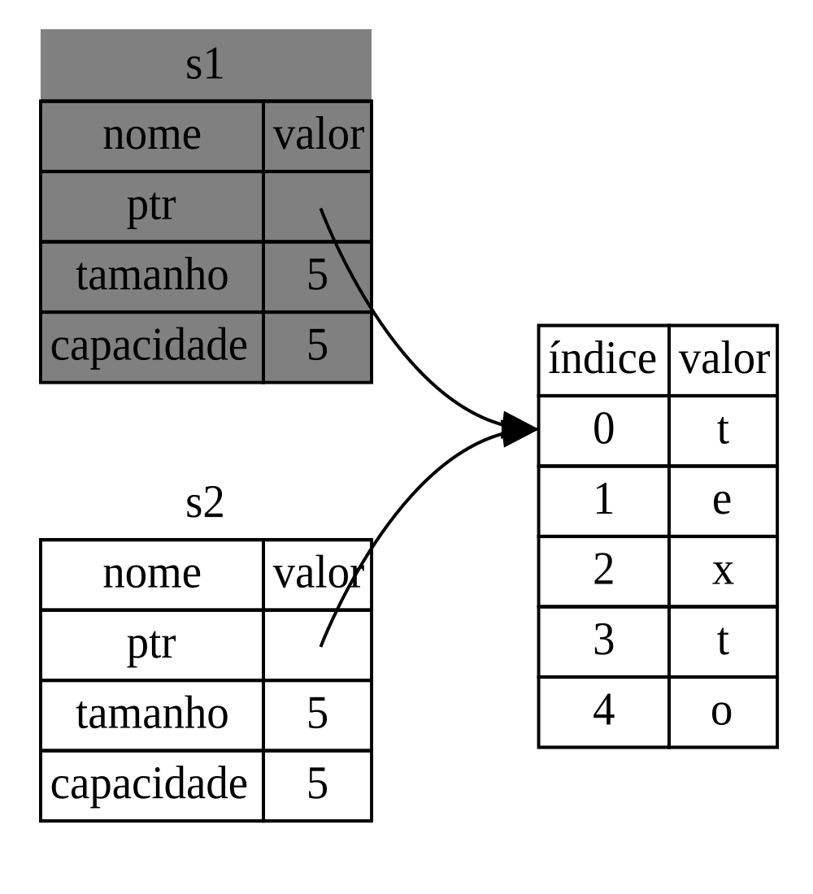
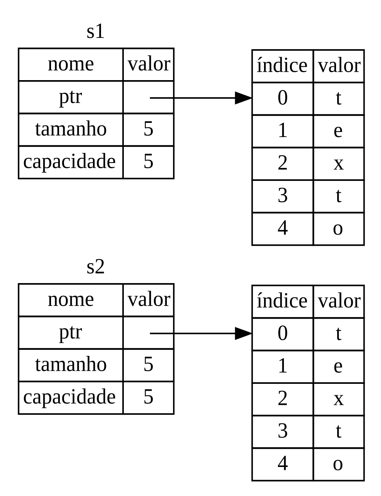

# Aprendendo rust

Aprendendo rust com exercícios da documentação.

## Projetos do repositório

- `actix_hello_world` — aplicação mínima em Rust com o framework Actix para aprender criação de APIs e servidores web.
- `algoritmos` — exercícios de busca, ordenação e algoritmos clássicos em Rust.
- `arc_mutex` — exemplos de concorrência usando `Arc` e `Mutex` para compartilhar dados entre threads.
- `array` — estudos sobre arrays e manipulação de estruturas indexadas.
- `branches` — exemplos de controle de fluxo com condicionais e branches.
- `cap1` a `cap10` — capítulos de aprendizado com pequenos projetos e exercícios do curso sobre Rust.
- `concorrencia` — exemplos de programação concorrente e paralelismo.
- `dio` — projetos pessoais e desafios de estudo da plataforma DIO em Rust.
- `enum_example` — exemplos de enums, pattern matching e modelagem de dados.
- `error_handling` — práticas de tratamento de erros e propagação de falhas.
- `function` — estudo de funções, parâmetros e modularização.
- `loops` — exercícios com laços e iteração.
- `match_example` — exemplos de uso de `match` para tomada de decisões.
- `mods` — exemplos de módulos e organização de código em Rust.
- `nao_tem_null` — comparação com ausência de `null` e uso de tipos seguros.
- `rand` — aplicação de geração de números aleatórios com a crate `rand`.
- `rocket_hello_world` — exemplo inicial de API web com Rocket.
- `rustfs` — projeto com estrutura de backend/frontend para explorar desenvolvimento mais completo.
- `somador` — exercícios simples de soma e operações matemáticas.
- `testes` — introdução a testes unitários e validação de comportamento.
- `tipos` — estudo de tipos primitivos, conversões e inferência.
- `uppercaser` — exemplo de transformação de strings para letras maiúsculas.
- `variaveis` — exercícios sobre variáveis, mutabilidade e escopo.

```bash
cargo --version
cargo new hello-rust
cargo run
cargo watch

cargo build
cargo build --release

cargo check
```

## Documentação

```bash
cargo doc --open
```

## Ownership:

- Cada valor em Rust possui uma variável que é dita seu owner (sua dona).
- Pode apenas haver um owner por vez.
- Quando o owner sai fora de escopo, o valor será destruído.

É importante saber se a variavel está alocado na heap ou na stack!
Valores que vão para stack sao valores de valor fixo como variaveis escalares, para heap vao variaveis com valores dinamicos como strings.

### Move

Move o ponteiro de uma variavel para outra, somente a segunda variavel aponta para a string na heap (move ownership)

```bash
 let s1 = String::from("texto");
let s2 = s1;

println!("{}", s1);
```

```bash
error[E0382]: use of moved value: `s1`
 --> src/main.rs:5:20
  |
3 |     let s2 = s1;
  |         -- value moved here
4 |
5 |     println!("{}", s1);
  |                    ^^ value used here after move
  |
  = note: move occurs because `s1` has type `std::string::String`, which does
  not implement the `Copy` trait
```



usando clone para clonar os dados na heap

```bash
let s1 = String::from("texto");
let s2 = s1.clone();

println!("s1 = {}, s2 = {}", s1, s2);
```



### Borrowing

Emprestar um valor nao passa o ownership da variavel fazendo com que ao sair de escopo o valor referenciado nao seja destruido como no caso de mover o dono.
A referencia não possui o valor.

```bash
fn main() {
    let s1 = String::from("texto");

    let tamanho = calcula_tamanho(&s1);

    println!("O tamanho de '{}' é {}.", s1, tamanho);
}

fn calcula_tamanho(s: &String) -> usize {
    s.len()
}
```

Assim como as variáveis são imutáveis por padrão, referências também são. Não temos permissão para modificar algo para o qual temos uma referência.

```bash
fn main() {
    let s = String::from("texto");

    modifica(&s);
}

fn modifica(uma_string: &String) {
    uma_string.push_str(" longo");
}
```

```bash
error[E0596]: cannot borrow immutable borrowed content `*uma_string` as mutable
 --> main.rs:8:5
  |
7 | fn modifica(uma_string: &String) {
  |                         ------- use `&mut String` here to make mutable
8 |     uma_string.push_str(" longo");
  |     ^^^^^^^^^^ cannot borrow as mutable
```

#### Referencias mutaveis

```bash
fn main() {
    let mut s = String::from("texto");

    modifica(&mut s);
}

fn modifica(uma_string: &mut String) {
    uma_string.push_str(" longo");
}
```

Mas referências mutáveis possuem uma grande restrição: você só pode ter uma referência mutável para um determinado dado em um determinado escopo.
Nós também não podemos ter uma referência mutável enquanto temos uma imutável. Usuários de uma referência imutável não esperam que os valores mudem de repente! Porém, múltiplas referências imutáveis são permitidas, pois ninguém que esteja apenas lendo os dados será capaz de afetar a leitura que está sendo feita em outra parte do código.

Em um dado momento, você pode ter um ou outro, mas não os dois:

- Uma referência mutável.
- Qualquer número de referências imutáveis.

Referências devem ser válidas sempre
